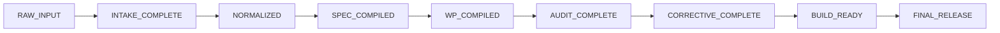

# 🛡️ ShipGate

> **Deterministic Quality Gate & AI Project Finalization / Delivery Engine**  
> *Compile heterogeneous, messy project requirements into auditable, zero-hallucination, coding-agent-ready specification packages.*

[](https://github.com/nguyenxp3n/shipgate/actions/workflows/ci.yml)
[](https://www.python.org/downloads/)
[](LICENSE)
[](docs/superpowers/specs/shipgate-architecture-spec.md)

---

## 📖 Table of Contents
1. [Overview & Core Philosophy](#-overview--core-philosophy)
2. [The Problem ShipGate Solves](#-the-problem-shipgate-solves)
3. [Key Pillars of the System](#-key-pillars-of-the-system)
   - [1. Typed Authority Matrix](#1-typed-authority-matrix)
   - [2. Work Package (WP) Contract](#2-work-package-wp-contract)
   - [3. Multi-Layer Deterministic Validation](#3-multi-layer-deterministic-validation)
   - [4. Immutable State Machine & Lifecycle](#4-immutable-state-machine--lifecycle)
   - [5. Reproducible Release Compiler](#5-reproducible-release-compiler)
4. [Agent Adapters & Ecosystem Support](#-agent-adapters--ecosystem-support)
5. [CLI Reference & Operations](#-cli-reference--operations)
6. [Quickstart Guide](#-quickstart-guide)
7. [Repository Structure](#-repository-structure)
8. [Important Distinction: BUILD_READY vs PRODUCTION_READY](#-important-distinction-build_ready-vs-production_ready)

---

## 🎯 Overview & Core Philosophy

**ShipGate** is an enterprise-grade orchestration and verification framework designed to bridge the dangerous gap between **rough human project requirements** and **autonomous AI coding agents** (Claude Code, Gemini Antigravity, OpenAI Codex, OpenDevin, Cursor, etc.).

Instead of feeding raw, contradictory notes directly to an LLM and hoping it doesn't hallucinate or overwrite critical files, **ShipGate** compiles project materials into a strictly validated, machine-enforceable specification package with deterministic boundaries.

### 💎 Core Principles
* **Zero Hallucination:** Deterministic static analyzers and schema validators are always favored over LLM guesswork.
* **Controlled Autonomy:** `UNKNOWN != PERMISSION TO INVENT`. Whenever an AI agent or contributor encounters protected ambiguity (architecture, security, API shapes, database schemas), ShipGate blocks progression and requires a formal **Decision Request (DR)**.
* **Hermetic Resource Locking:** Every subagent task is restricted to a precise **Permission Envelope** (`allowed_paths`, `forbidden_paths`) to guarantee safe parallel execution without merge conflicts.

---

## ⚠️ The Problem ShipGate Solves

When teams instruct AI coding agents to implement complex software, projects routinely fail due to five failure modes:

| Failure Mode | How AI Agents Fail | How ShipGate Fixes It |
| :--- | :--- | :--- |
| **Scope Drift & Overreach** | Agent modifies unrelated backend or auth files while doing frontend styling. | Strict **Permission Envelope** (`allowed_paths`, `forbidden_paths`) rejected at validation time. |
| **Authority Conflicts** | Old meeting notes contradict the latest OpenAPI spec; agent picks whichever prompt it prefers. | **Typed Authority Matrix** with strictly segregated domains (Product, Contracts, Security, Ordering). |
| **Hallucinated Contracts** | Agent invents database fields or API response formats that don't exist. | Pre-validated **Machine Contracts** (OpenAPI, JSON Schema, DB entity mappings). |
| **Silent Circular Dependencies** | Multi-agent pipelines deadlock because tasks depend on each other implicitly. | **Work Package DAG Compiler** that verifies topological order and entrypoint validity. |
| **False Completion Claims** | Agent claims "All tasks done!" when critical security tests or lint gates failed. | **Zero-Trust Audit Gate** requiring verifiable command exit codes and SHA-256 sidecars. |

---

## 🏛️ Key Pillars of the System

### 1. Typed Authority Matrix
ShipGate bans flat precedence ladders. Authority is segregated strictly by **subject domain**:

```yaml
subjects:
  product_behavior:
    composition: single
    primary: [docs/specs/shipgate-architecture-spec.md]
  machine_contracts:
    composition: composed
    primary: [schemas/*.schema.json, contracts/openapi/openapi.yaml]
  security_invariants:
    composition: single
    primary: [core/security/SECURITY-RULES.md]
  implementation_ordering:
    composition: single
    primary: [self-hosting/work-packages/graph.yaml]
  historical_audit:
    authority: advisory_only  # Advisory evidence NEVER overrides normative authority!
```

### 2. Work Package (WP) Contract
The fundamental unit of execution in ShipGate is the **Work Package (WP)**. Every task assigned to an agent or developer must adhere to `schemas/work-package.schema.json`:

```yaml
- id: WP-001
  title: Core engine implementation
  state: READY
  purpose: Implement state transitions and authority lifecycle.
  depends_on: [WP-000]
  authority_refs: [docs/superpowers/specs/shipgate-architecture-spec.md]
  allowed_paths: [src/project_finalizer/**]
  forbidden_paths: [contracts/**, schemas/**]
  acceptance_commands: [task test]
  stop_conditions: [public contract change required, security escalation]
```

### 3. Multi-Layer Deterministic Validation
ShipGate runs a layered validation pipeline before any release or handoff:
1. **Syntax Layer:** Validates YAML/JSON parse integrity and formatting.
2. **References Layer:** Verifies that all file paths and external links exist on disk.
3. **Authority Layer:** Detects conflicting primaries and advisory leakage.
4. **Ownership Layer:** Ensures foreign table writes or unauthorized file mutations are caught.
5. **API Layer:** Validates OpenAPI specs and checks duplicate operation IDs.
6. **Profile Layer (`web-saas`):** Enforces multi-tenant DB keying, CSRF tokens, async idempotency, and test matrices.
7. **Readiness Layer:** Aggregates blockers to compute the project readiness verdict (`PASS` / `FAIL`).

### 4. Immutable State Machine & Lifecycle
A project progresses deterministically through strict phases:



State changes are atomic; interrupted runs or crashes safely rollback to the last verified state.

### 5. Reproducible Release Compiler
When `shipgate release` is executed:
* Pre-flight self-hosting checks ensure no open blockers or stale artifacts.
* Source is staged into an isolated clean environment.
* Generates `SHA256SUMS.txt` matching all constituent files.
* Builds the verified `.zip` archive and emits a cryptographic sidecar (`.zip.sha256`).
* Performs fresh re-extraction and bitwise integrity verification before declaring success.

---

## 🤖 Agent Adapters & Ecosystem Support

ShipGate provides dedicated prompt adapters and role-definition manifests for top AI developer environments:

| Adapter | Directory | Optimized Capabilities |
| :--- | :--- | :--- |
| **Claude Code** | `adapters/claude-code/` | Subagent task briefs, review packages, SDD (Subagent-Driven Development). |
| **Gemini Antigravity** | `adapters/gemini-antigravity/` | Artifact generation, native tool integration, structured workflows. |
| **OpenAI / Codex** | `adapters/codex/` | Concise instruction packaging, test-driven validation triggers. |
| **Generic Multi-Agent** | `adapters/generic/` | Role-agnostic task assignment and reviewer prompts. |

---

## 💻 CLI Reference & Operations

ShipGate exposes a unified CLI interface:

```bash
# General Syntax
shipgate <command> [--project <path>] [options]
```

### 🛠️ Common Commands

| Command | Purpose & Description |
| :--- | :--- |
| `shipgate init <path> [--profile web-saas]` | Initializes a fresh ShipGate workspace with preconfigured schema boundaries. |
| `shipgate inspect` | Inspects workspace files, detected profiles, and active lifecycle state. |
| `shipgate validate [--format human\|json]` | Executes the full 7-layer validation engine against the project. |
| `shipgate readiness` | Evaluates whether all preconditions are met for coding-agent handoff (`BUILD_READY`). |
| `shipgate release [--output <file.zip>]` | Compiles a reproducible, bitwise-verified release archive with SHA-256 sidecar. |
| `shipgate decisions list\|show\|resolve` | Tracks and resolves architectural or protected Decision Requests (DR). |
| `shipgate transition <TARGET_STATE>` | Safely transitions the project lifecycle state machine. |
| `shipgate --version` | Outputs current ShipGate engine version (`shipgate 2.0.0`). |

---

## 🚀 Quickstart Guide

### Prerequisites
* Python `3.12`
* [`uv`](https://docs.astral.sh/uv/) (Recommended) or standard Python `pip`
* [`Task`](https://taskfile.dev/) (Optional task runner)

### Installation

```bash
# Clone the repository
git clone https://github.com/nguyenxp3n/shipgate.git
cd shipgate

# Sync dependencies and development toolchain with uv
uv sync --all-extras

# Run full Quality Assurance suite (Format + Lint + Typecheck + Tests)
task qa
# Alternatively, via standard uv:
uv run ruff check .
uv run mypy src
uv run pytest
```

### Running Self-Validation
Verify that the ShipGate repository itself satisfies all self-hosting quality gates:

```bash
# Run release dry-run (self-hosting validation)
uv run shipgate validate

# Compile a verified release archive
uv run shipgate release --output ./shipgate-distribution.zip
```

---

## 📂 Repository Structure

```text
shipgate/
├── core/                   # Canonical Generic Core assets
│   ├── authority/          # Authority matrix definitions & rules
│   ├── work-packages/      # WP compiler rules, schemas, and stop conditions
│   ├── audit/              # Zero-trust senior auditor rubric
│   └── release/            # Build readiness criteria
├── schemas/                # Formal JSON Schemas (work-package, state, decisions)
├── profiles/               # Specialized profiles (e.g. web-saas extensions & DB rules)
├── prompts/                # Ready-to-use role prompts (Lead, Worker, Auditor, Integrator)
├── adapters/               # Provider-specific instructions (Claude, Gemini, Codex)
├── self-hosting/           # Self-hosting validation package for ShipGate itself
├── src/                    # Deterministic orchestration & validation engine
│   └── project_finalizer/  # Core Python package implementing ShipGate algorithms
├── tests/                  # Exhaustive test suite (Unit, Integration, Fixtures, Release)
├── docs/                   # Full architecture specs and implementation plans
│   └── superpowers/specs/  # Definitive ShipGate Architecture Specification
├── Taskfile.yml            # Canonical command gateway for contributors
└── pyproject.toml          # Project metadata, dependencies, and CLI script entrypoints
```

---

## ⚡ Important Distinction: BUILD_READY vs PRODUCTION_READY

> [!IMPORTANT]
> In ShipGate, **`BUILD_READY`** means:
> * All source requirements and contracts have been normalized and audited.
> * All work packages have clear permission boundaries and automated acceptance checks.
> * The specification package is 100% complete and verified for an **autonomous coding agent** to begin implementation safely.
> 
> **`BUILD_READY` does NOT mean:**
> * The target application code has been fully written or tested in a production environment.
> * Runtime performance and load testing have passed.

---

## 📄 License
This project is licensed under the [MIT License](LICENSE).
